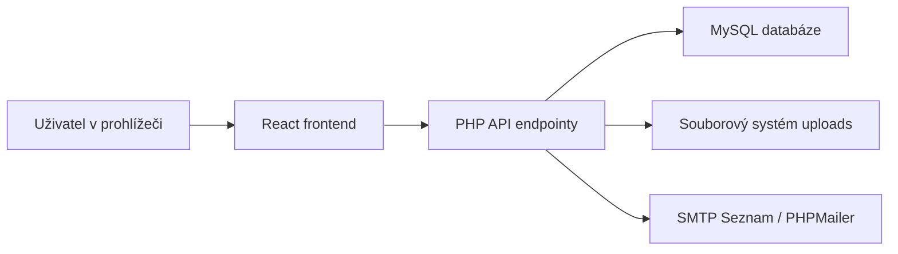
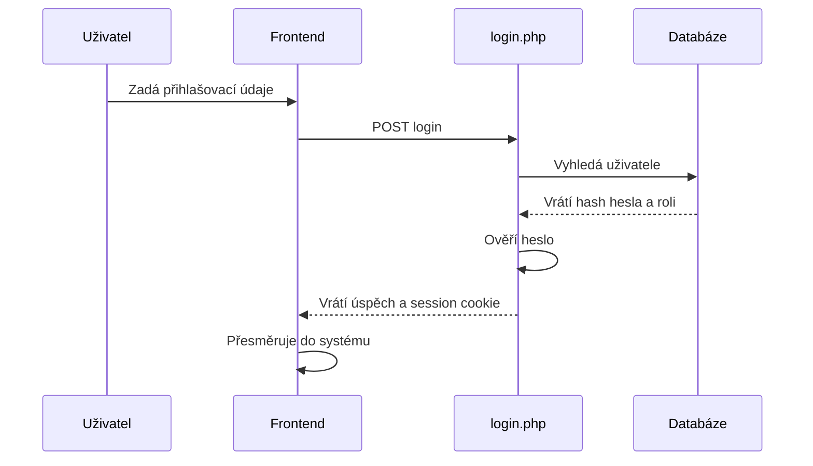
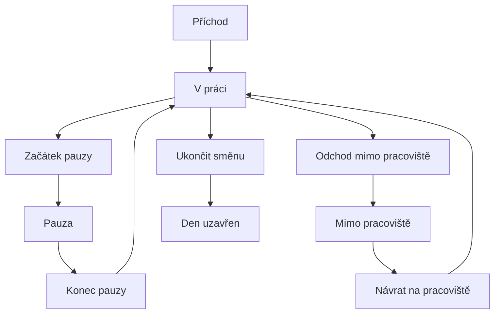
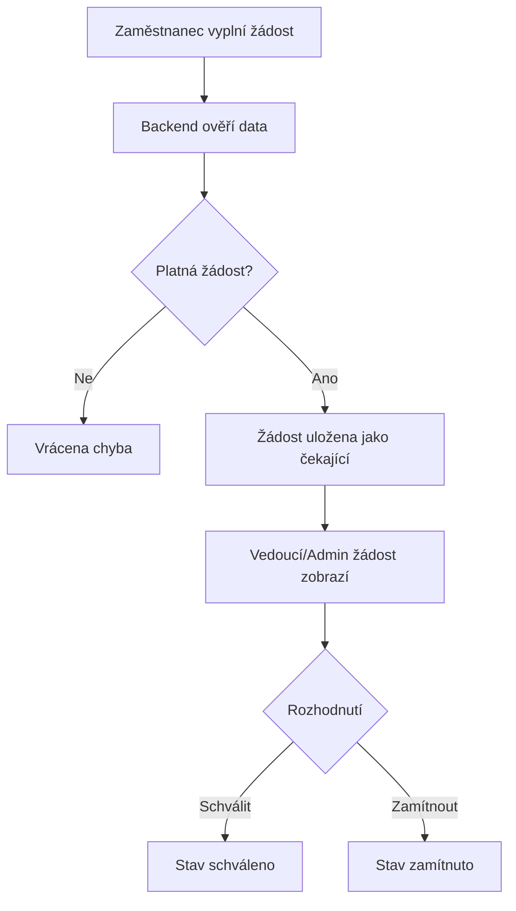
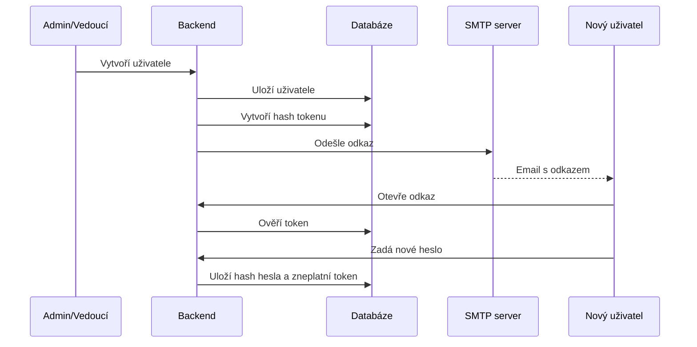

# SDD - Software Design Document

## 1. Identifikace dokumentu

**Název projektu:** Chronis  
**Typ systému:** Webová docházková a administrační aplikace  
**Autor projektu:** Lukáš Mareš  
**Verze dokumentu:** 1.0  
**Datum:** 28. 5. 2026

## 2. Účel dokumentu

Tento dokument popisuje návrh a technické řešení aplikace Chronis. Navazuje na SRS dokument a vysvětluje architekturu, rozdělení frontendové a backendové části, datový model, bezpečnostní mechanismy, hlavní procesy a způsob nasazení.

## 3. Přehled systému

Chronis je webová aplikace pro správu docházky a absencí. Skládá se z veřejné prezentační části a interní systémové části přístupné po přihlášení.

Systém používá:

- React pro frontend,
- Vite jako vývojový server a build nástroj,
- Tailwind CSS pro stylování,
- PHP pro backend API,
- MySQL databázi,
- PDO pro práci s databází,
- PHPMailer pro odesílání emailů,
- session autentizaci.

## 4. Architektonický návrh

Systém je navržen jako klasická webová aplikace s odděleným frontendem a backendem.



### 4.1 Frontend

Frontend je single-page aplikace. Router zajišťuje přepínání mezi stránkami bez plného reloadu aplikace.

Hlavní odpovědnosti frontendu:

- zobrazení uživatelského rozhraní,
- správa lokálního stavu formulářů,
- volání backend API,
- kontrola přístupu na úrovni rout,
- responzivní rozložení obrazovek,
- zobrazení stavových a chybových hlášek.

### 4.2 Backend

Backend je tvořen PHP endpointy dostupnými přes `http://localhost/api/...`.

Hlavní odpovědnosti backendu:

- připojení k databázi,
- autentizace přes session,
- autorizace podle role,
- validace vstupů,
- ukládání a načítání dat,
- práce s docházkovými událostmi,
- generování exportů,
- odesílání emailů,
- ukládání nahraných fotek.

### 4.3 Databáze

Databáze MySQL ukládá aplikační data. Přístup probíhá přes PDO.

## 5. Struktura projektu

### 5.1 Kořen projektu

- `README.md` - základní informace o projektu,
- `docs/` - dokumentace SRS a SDD,
- `backend/` - PHP backend,
- `frontend/` - React frontend,
- diagramy a doplňkové podklady.

### 5.2 Frontend struktura

- `frontend/src/app/AppRoutes.jsx` - hlavní routování aplikace,
- `frontend/src/layouts/SystemLayout.jsx` - layout interní systémové části,
- `frontend/src/components/` - sdílené komponenty,
- `frontend/src/components/system/PageHeader.jsx` - jednotný nadpis systémových stránek,
- `frontend/src/pages/` - jednotlivé stránky aplikace,
- `frontend/src/assets/` - obrázky a statické assety,
- `frontend/src/utils/` - pomocné funkce.

### 5.3 Backend struktura

- `backend/*.php` - veřejné API endpointy,
- `backend/connection.php` - připojení k databázi,
- `backend/auth_helpers.php` - pomocné funkce pro role a oprávnění,
- `backend/shift_helpers.php` - pomocné funkce pro směny,
- `backend/password_reset_helpers.php` - tokeny a emaily pro nastavení hesla,
- `backend/user_photo_helpers.php` - ukládání fotek zaměstnanců,
- `backend/src/Support/api.php` - společný bootstrap pro novější endpointy,
- `backend/src/Repositories/` - databázová vrstva pro zprávy,
- `backend/src/Services/` - aplikační logika pro zprávy,
- `backend/sql/` - migrační SQL/PHP skripty,
- `backend/uploads/users/` - nahrané nebo demonstrační fotky zaměstnanců.

## 6. Frontend návrh

### 6.1 Routování

Frontend používá `react-router-dom`.

Veřejné routy:

- `/` - hlavní stránka,
- `/o-nas` - stránka O nás,
- `/kontakty` - kontakty,
- `/login` - přihlášení,
- `/nastavit_heslo` - nastavení hesla přes token.

Chráněné routy pro přihlášené uživatele:

- `/system_main`,
- `/moje_dochazka`,
- `/moje_zadosti`,
- `/historie_dochazky`,
- `/zadost_o_absenci`,
- `/napoveda`,
- `/zpravy`,
- `/recenze`.

Routy pro administrátora nebo vedoucího:

- `/schvalovani_absenci`,
- `/dochazkove_reporty`,
- `/exporty`,
- `/uzivatele`,
- `/uzivatele/:id`.

Routy pouze pro administrátora:

- `/nastaveni`,
- `/System_Firmy`,
- `/System_Firmy_Edit/:id`.

Speciální routy:

- `/nemate-pristup` - stránka nedostatečného oprávnění,
- `*` - stránka neexistující adresy.

### 6.2 Ochrana rout

Frontend používá tři obalové komponenty:

- `ProtectedRoute` - vyžaduje přihlášení,
- `AdminOrManagerRoute` - vyžaduje administrátora nebo vedoucího,
- `AdminRoute` - vyžaduje administrátora.

Tyto komponenty volají `get_user.php`, ověří session a podle výsledku zobrazí stránku, přesměrují na login nebo zobrazí stránku bez přístupu.

### 6.3 Hlavní stránky

#### Home

Veřejná hlavní stránka prezentuje aplikaci Chronis.

#### AboutPage

Stránka O nás popisuje projekt a tým.

#### ContactsPage

Obsahuje kontakty, členy týmu, mapu a formulář pro domluvu schůzky.

#### Login

Přihlašovací formulář pro vstup do systému.

#### System_main

Dashboard se mění podle role uživatele:

- administrátor vidí systémový přehled,
- vedoucí vidí týmový dashboard,
- zaměstnanec vidí svůj docházkový dashboard.

#### MojeDochazka

Stránka pro docházkové akce. Obsahuje tlačítka pro příchod, pauzu, mimo pracoviště a ukončení směny.

#### HistorieDochazky

Zobrazuje historii docházky zaměstnance.

#### ZadostOAbsenci

Formulář pro vytvoření žádosti o absenci.

#### MojeZadosti

Přehled vlastních žádostí zaměstnance.

#### SchvalovaniAbsenci

Stránka pro administrátory a vedoucí pro schvalování žádostí.

#### Uzivatele a UzivatelEdit

Správa uživatelů, včetně rolí, směn, fotky, účtu a aktivního stavu.

#### System_Firmy a System_Firmy_Edit

Správa firem, adres a ročního nároku dovolené.

#### DochazkoveReporty

Přehled docházkových statistik.

#### Exporty

Vytváření CSV a XLSX exportů.

#### Zpravy

Interní zprávy a systémové notifikace.

#### Recenze

Odeslání uživatelské recenze, zobrazení vlastních recenzí a administrátorská moderace.

#### Nastaveni

Systémová nastavení dostupná administrátorovi.

#### Napoveda

Uživatelská nápověda.

## 7. Backend návrh

### 7.1 Připojení k databázi

Soubor `connection.php` vytváří PDO připojení k MySQL databázi `chronisdb`.

Připojení používá:

- server `localhost`,
- uživatele `root`,
- prázdné heslo pro lokální WAMP,
- režim chyb PDO exception.

### 7.2 Autentizace

Autentizace je řešena přes PHP session.

Po přihlášení endpoint `login.php` uloží do session:

- ID uživatele,
- jméno,
- příjmení,
- přihlašovací jméno,
- pozici,
- příznak administrátora,
- příznak vedoucího.

Endpoint `get_user.php` vrací aktuálně přihlášeného uživatele.

Endpoint `logout.php` ruší session.

### 7.3 Autorizace

Autorizace je řešena v `auth_helpers.php`.

Pomocné funkce:

- zjištění ID aktuálního uživatele,
- zjištění pozice,
- kontrola administrátora,
- kontrola vedoucího,
- zjištění firmy aktuálního uživatele,
- kontrola, zda oddělení patří do firmy vedoucího.

### 7.4 Hlavní API endpointy

#### Autentizace

- `login.php` - přihlášení,
- `logout.php` - odhlášení,
- `get_user.php` - informace o přihlášeném uživateli.

#### Firmy

- `get_firmy.php` - seznam firem,
- `get_firma_by_id.php` - detail firmy,
- `create_firma.php` - vytvoření firmy,
- `update_firma.php` - úprava firmy,
- `delete_company.php` - smazání firmy.

#### Uživatelé

- `get_uzivatele.php` - seznam uživatelů,
- `get_uzivatel_by_id.php` - detail uživatele,
- `create_uzivatel.php` - vytvoření uživatele,
- `update_uzivatel.php` - úprava uživatele,
- `delete_uzivatel.php` - smazání uživatele.

#### Docházka

- `dochazka_dnes.php` - dnešní stav docházky,
- `dochazka_akce.php` - uložení docházkové akce,
- `dochazka_historie.php` - historie docházky,
- `employee_dashboard.php` - data pro dashboard zaměstnance.

#### Absence

- `zadost_absence.php` - vytvoření žádosti,
- `moje_zadosti.php` - vlastní žádosti,
- `absence_admin.php` - žádosti pro schvalování,
- `absence_update.php` - schválení nebo zamítnutí.

#### Reporty a exporty

- `dochazkove_reporty.php` - docházkové reporty,
- `exporty.php` - export dat do CSV/XLSX.

#### Zprávy

- `zpravy.php` - načtení a odeslání zpráv.

#### Recenze

- `reviews.php` - veřejné načtení schválených recenzí, interní načtení recenzí uživatele, odeslání nové recenze a administrátorská změna stavu.

#### Nastavení a nápověda

- `nastaveni.php` - systémová nastavení.

#### Email a heslo

- `send.php` - kontaktní formulář,
- `overit_token_hesla.php` - ověření tokenu pro nastavení hesla,
- `nastavit_heslo.php` - nastavení nového hesla,
- `password_reset_helpers.php` - vytvoření tokenu a odeslání emailu.

## 8. Databázový návrh

### 8.1 Hlavní entity

#### `zamestnanci`

Ukládá zaměstnance a uživatelské účty.

Hlavní atributy:

- `id_zamestnanec`,
- `jmeno`,
- `prijmeni`,
- `email`,
- `telefon`,
- `fotka_cesta`,
- `cip`,
- `mzda`,
- `datum_nastupu`,
- `id_pozice`,
- `id_oddeleni`,
- `id_vychozi_smena`,
- `prihlasovaci_jmeno`,
- `heslo`,
- `aktivni`.

#### `pozice`

Definuje role uživatelů.

Typické role:

- administrátor,
- vedoucí směny,
- zaměstnanec.

#### `firmy`

Ukládá firmy.

Hlavní atributy:

- `id_firma`,
- `nazev`,
- `ico`,
- `email`,
- `telefon`,
- `id_adresa`,
- `logo_cesta`,
- `dovolena_dni`.

#### `oddeleni`

Ukládá oddělení a vazbu na firmu.

#### `adresy` a `posty`

Ukládají adresní údaje firem.

#### `dochazka_dny`

Ukládá denní souhrn docházky.

Hlavní atributy:

- zaměstnanec,
- datum,
- příchod,
- odchod,
- pauza v minutách,
- čas mimo pracoviště v minutách,
- odpracováno minut,
- stav.

#### `dochazka_udalosti`

Ukládá jednotlivé docházkové události.

Typy událostí:

- `prichod`,
- `odchod`,
- `zacatek_pauzy`,
- `konec_pauzy`,
- `odchod_mimo_pracoviste`,
- `navrat_na_pracoviste`.

#### `zadosti_absence`

Ukládá žádosti o absenci.

Hlavní atributy:

- zaměstnanec,
- typ absence,
- datum od,
- datum do,
- čas od,
- čas do,
- poznámka,
- stav,
- schvalující uživatel.

#### `typy`

Ukládá typy absencí.

#### `smeny`

Ukládá definice směn.

Atributy:

- název,
- čas od,
- čas do,
- tolerance minut,
- úvazek minut,
- aktivní stav.

#### `plan_smen`

Ukládá plán konkrétní směny pro konkrétního zaměstnance a datum. Slouží jako rozšíření pro budoucí detailní plánování směn.

#### `systemova_nastaveni`

Ukládá nastavení systému.

#### `tokeny_hesel`

Ukládá jednorázové tokeny pro nastavení hesla.

Atributy:

- zaměstnanec,
- hash tokenu,
- platnost do,
- použito,
- vytvořeno,
- použito dne.

#### `zpravy`

Ukládá interní zprávy a systémové notifikace.

#### `recenze`

Ukládá zpětnou vazbu od uživatelů systému.

Hlavní údaje:

- `id_recenze`,
- `id_zamestnanec`,
- `text_recenze`,
- `hodnoceni`,
- `stav`,
- `vytvoreno`.

## 9. Návrh hlavních procesů

### 9.1 Přihlášení



### 9.2 Evidence docházky



### 9.3 Žádost o absenci



### 9.4 Nastavení hesla přes email



## 10. Bezpečnostní návrh

### 10.1 Hesla

Hesla jsou ukládána pomocí `password_hash`. Ověření probíhá přes `password_verify`.

### 10.2 Session

Po přihlášení se ukládá uživatel do PHP session.

### 10.3 Oprávnění

Backend kontroluje oprávnění u chráněných endpointů. Frontend zároveň skrývá nepovolené stránky v navigaci.

### 10.4 Tokeny hesel

Token pro nastavení hesla se v databázi neukládá přímo. Ukládá se pouze jeho SHA-256 hash.

Token:

- má omezenou platnost,
- je jednorázový,
- po použití se označí jako použitý.

### 10.5 Omezení vedoucího

Vedoucí směny smí pracovat pouze s daty své firmy. Backend kontroluje vazbu oddělení a firmy.

## 11. Návrh ukládání souborů

Fotografie zaměstnanců se ukládají do:

`backend/uploads/users/`

Do databáze se ukládá relativní cesta, například:

`uploads/users/demo-employee-01.png`

Frontend obrázek načítá přes:

`http://localhost/api/uploads/users/...`

## 12. Emailové řešení

Systém používá PHPMailer.

Konfigurace je v:

`backend/config.env`

Použité hodnoty:

- `EMAIL_USER`,
- `EMAIL_PASS`,
- `SMTP_HOST`,
- `SMTP_PORT`,
- `SMTP_SECURE`,
- `APP_URL`.

Email se používá pro:

- kontaktní formulář,
- zaslání odkazu pro nastavení hesla.

## 13. Exporty

Endpoint `exporty.php` umí vytvořit export ve formátu:

- CSV,
- XLSX.

XLSX se generuje serverově jako tabulkový soubor. Export obsahuje záhlaví, data a formátování vhodné pro další práci v tabulkovém editoru.

## 14. Nasazení a běh

### 14.1 Lokální vývoj

Frontend:

```bash
cd frontend
npm install
npm run dev
```

Backend:

- zkopírovat obsah `backend/` do `C:\wamp64\www\api`,
- spustit WAMP,
- importovat databázi nebo spustit migrační skripty.

### 14.2 Build frontendu

```bash
cd frontend
npm run build
```

### 14.3 Databázové migrace

Migrační skripty jsou v `backend/sql/`.

Použité doplňkové migrace:

- `smeny.php`,
- `firma_dovolena.php`,
- `dochazka_mimo_pracoviste.php`,
- `fotky_zamestnancu.php`,
- `tokeny_hesel.php`.

## 15. Technologie

### Frontend

- React,
- React Router,
- Vite,
- Tailwind CSS,
- Lucide React ikony.

### Backend

- PHP,
- PDO,
- PHPMailer,
- MySQL.

### Vývojové prostředí

- Windows,
- WAMP,
- Node.js,
- npm.

## 16. Další rozšiřitelnost

Systém je připraven na další rozšíření:

- detailní plánování směn,
- pokročilé schvalovací workflow,
- auditní log změn,
- automatické notifikace,
- lepší produkční konfiguraci,
- nasazení na server s HTTPS,
- automatické zálohování databáze,
- napojení na čtečku čipů nebo kioskovou aplikaci.

## 17. Známá omezení aktuální verze

- Backend je částečně stále tvořen samostatnými PHP endpointy.
- Produkční bezpečnost by vyžadovala HTTPS a oddělení tajných údajů mimo repozitář.
- Automatické zálohování databáze není implementováno.
- Detailní plán směn existuje v databázi, ale nemá samostatné plné UI.
- Projekt je optimalizován hlavně pro školní prezentaci a lokální běh.
